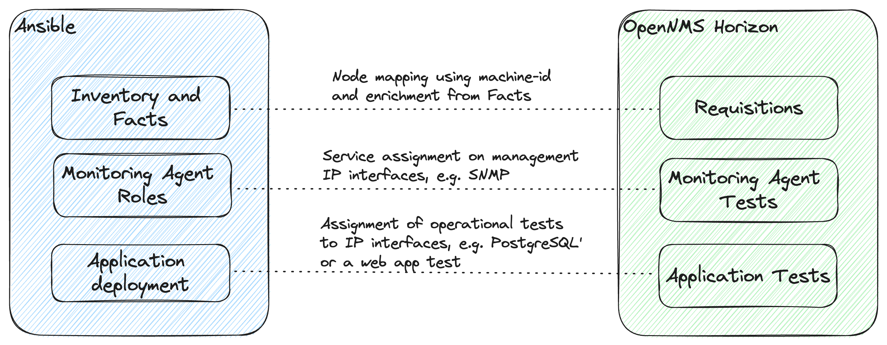

# Ansible provisioning into OpenNMS Horizon

We have seen a lot of people managing their system configuration with Ansible.
While this is a place where applications and monitoring agents get deployed, it is an ideal place to define how you want it to test during operations.
We think deploying applications serving in production and running operational tests, should be close together.
This repository is a conceptual playground investigating how we use Ansible to drive the node inventory and the service monitoring in OpenNMS Horizon.



## Goal

* Using environments like `dev`, `staging` and `prod` as a driver for requisitions as a node inventory in OpenNMS Horizon.
* Providing a workflow to deploy applications and assign operational service tests together with the application deployment.
* Give users some control in Ansible how the service needs to be monitored.

## Requirements

* Ansible
* sshpass
* Docker and Docker-Compose

`sudo apt install ansible sshpass`

## Usage

## Spin up OpenNMS Horizon with test nodes

In `./horizon/` is a `docker-compose` configuration to spin up an OpenNMS Horizon, and two Ubuntu clients locally on your computer.

To start the containers:
```
cd horizon/
docker-compose up -d
```

### IP addresses

OpenNMS Horizon: 172.16.238.11

Node1: 172.16.238.12

Node2: 172.16.238.13


## Ansible


### Horizon provisioning

In `./ansible` all ansible playbook, inventories and variables are stored.

Example call:
```
cd ansible
ansible-playbook horizon-provision.yml -i inventory/department1
```

When you run ansible the first time you probably get the following error message:

```
fatal: [node0]: FAILED! => {"msg": "Using a SSH password instead of a key is not possible because Host Key checking is enabled and sshpass does not support this.  Please add this host's fingerprint to your known_hosts file to manage this host."}
fatal: [node1]: FAILED! => {"msg": "Using a SSH password instead of a key is not possible because Host Key checking is enabled and sshpass does not support this.  Please add this host's fingerprint to your known_hosts file to manage this host."}
```

Just add the SSH fingerprint with the following commands:

```
ssh 172.16.238.12
ssh 172.16.238.13
```
You don't need to login, just adding the fingerprint to your `know_hosts` is enough.

### Deploying a web service

The playbook `install-webserver.yml` installs an Apache webserver.
We can choose `node1` or `node2` to install the packages.
The nodes have different ports defined in their inventory.

```
cd ansible
ansible-playbook install-webserver.yml --extra-vars "target=node2" -i inventory/department1/
```

## Hint from Mattermost chat about creating nodes

Flow for adding a node via APIs would be... 

* Create a Requisition
* Create a ForeignSource for the Requisition
* Import import?rescanExisting=false
* Add SNMP Config for a node
* Add a Node to Requisition
* Import [import?rescanExisting=false]


## Create a Requisition called fromCLI:

```
curl -vv -u admin:admin -XPOST -H 'Content-type: application/xml' -d '@emptyReq.xml'  "http://horizon:8980/opennms/rest/requisitions"
Content of emptyReq.xml
```
```
<model-import date-stamp="2022-09-22T09:31:05.469Z" foreign-source="fromCLI" last-import="2022-09-22T09:31:05.469Z">
</model-import>
```

## Create a ForeignSource for the Requisition fromCLI:

```
curl -v -u admin -H 'Content-type: application/xml' -XPOST -d '@fromCLI-foreignSource.xml' "http://horizon:8980/opennms/rest/foreignSources"
```

Content of fromCLI-foreignSource.xml file

```
<?xml version="1.0" encoding="UTF-8" standalone="yes"?>
<foreign-source xmlns="http://xmlns.opennms.org/xsd/config/foreign-source" name="fromCLI" date-stamp="2022-12-13T07:50:49.323Z">
    <scan-interval>1d</scan-interval>
    <detectors>
        <detector name="ICMP" class="org.opennms.netmgt.provision.detector.icmp.IcmpDetector"/>
        <detector name="SNMP" class="org.opennms.netmgt.provision.detector.snmp.SnmpDetector"/>
    </detectors>
    <policies>
        <policy name="Unmanage IP Interfaces" class="org.opennms.netmgt.provision.persist.policies.MatchingIpInterfacePolicy">
            <parameter key="action" value="UNMANAGE"/>
            <parameter key="matchBehavior" value="ALL_PARAMETERS"/>
        </policy>
    </policies>
</foreign-source>
```

## Import Requisition with rescanExisting=false

```
curl -v -u admin -H 'Content-type: application/xml' -XPUT "http://horizon:8980/opennms/rest/requisitions/fromCLI/import?rescanExisting=false"
```

## Add SNMP Config for an ip-address

```
curl -v -u admin -H 'Content-type: application/xml' -XPUT -d '@snmpInfo.xml' "http://horizon:8980/opennms/rest/snmpConfig/10.2.0.9"
```

## Add a Node to Requisition

```
curl -vv -u admin:admin -XPOST -H 'Content-type: application/xml' -d '@newNode.xml' "http://horizon:8980/opennms/rest/requisitions/fromCLI/nodes"
```

## Content of newNode.xml

```
 <?xml version="1.0" encoding="UTF-8" standalone="yes"?>
<node foreign-id="1111" node-label="google-dns2">
<interface ip-addr="8.8.8.8" status="1" snmp-primary="P"/>
</node>
```

## Import with rescanExisting=false

```
curl -v -u admin -H 'Content-type: application/xml' -XPUT "http://horizon:8980/opennms/rest/requisitions/fromCLI/import?rescanExisting=false"
```
